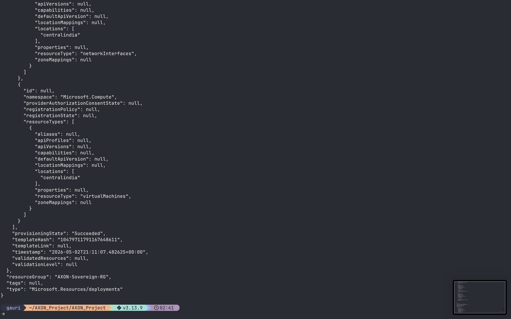
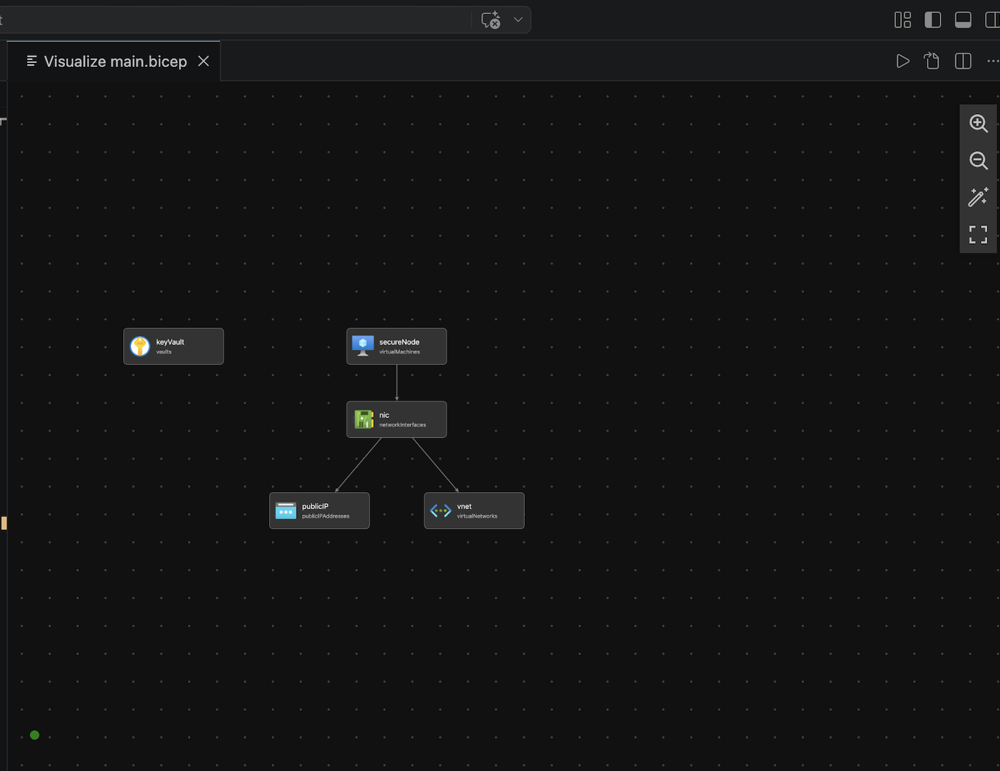
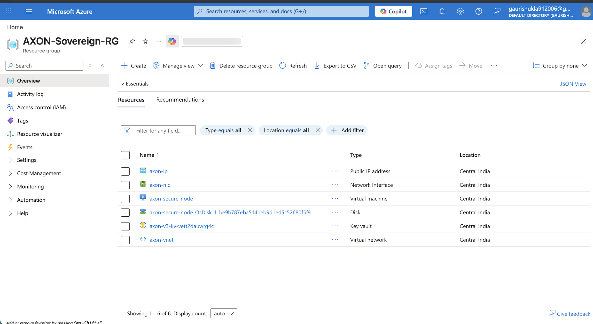
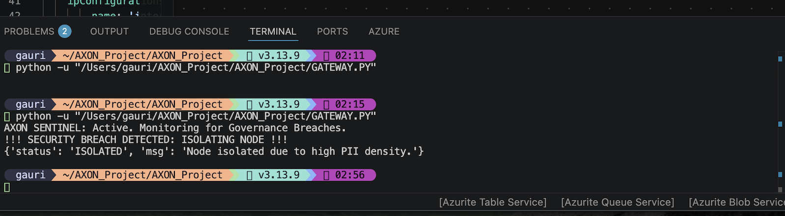

# AXON: Sovereign Data-Privacy Gateway

**AXON** is an orchestrated security layer designed to mitigate Personal Identifiable Information (PII) leakage during Large Language Model (LLM) interactions. It bridges the gap between AI utility and enterprise data residency requirements by enforcing privacy at the network perimeter.

## 🏛️ Architectural Overview
The system follows a **Zero-Trust** model, ensuring that compute resources are isolated and secrets are handled via hardware-backed vaults rather than environment variables.

* **Infrastructure as Code (IaC):** Orchestrated using **Azure Bicep** for deterministic, reproducible deployments.
* **Identity & Access:** Utilizes **Azure Key Vault** with **RBAC** and System-Assigned Managed Identities, ensuring a zero-credential footprint in the source code.
* **Networking:** Provisioned within a dedicated **Virtual Network (VNet)** utilizing **Standard SKU Public IPs** for granular ingress/egress control.


---

## 🛡️ Key Technical Innovations

### 1. Sentinel Reflex (Autonomous Governance)
AXON features a reactive security layer that monitors PII density in real-time. Unlike static filters, the **Sentinel Reflex** triggers a simulated **Node Isolation** protocol if a high-density data breach is detected, effectively severing the egress route to prevent unauthorized data exfiltration.

### 2. Edge-Based PII Redaction
The gateway implements an entropy-scanning engine that identifies and masks sensitive patterns (Phone numbers, IDs, emails) at the compute edge. This ensures that only sanitized, non-identifiable data is transmitted to the LLM provider.

### 3. Declarative Resource Lifecycle
By defining the entire stack in Bicep, AXON eliminates "configuration drift." The infrastructure is treated as software, allowing for automated security audits and rapid scaling across diverse cloud regions.

---

## 🛠️ Technical Specifications
* **Cloud Provider:** Microsoft Azure
* **Orchestration:** Azure Bicep
* **Security:** Key Vault, Managed Identities, RBAC
* **Runtime:** Python 3.x (Hardened Governance Logic)
* **Deployment OS:** Ubuntu 22.04 LTS

---

## 🚀 Deployment Instructions

### Infrastructure Provisioning
1.  **Initialize the Environment:**
    ```bash
    az group create --name AXON-Sovereign-RG --location centralindia
    ```
2.  **Deploy the Stack:**
    ```bash
    az deployment group create --resource-group AXON-Sovereign-RG --template-file main.bicep
    ```

### Gateway Execution
Execute the governance engine locally or on the provisioned node:
```bash
python3 gateway.py
```

### 📊 Technical Validation

* [cite_start]**Infrastructure Provisioning:** Successful orchestration confirmed via Azure Bicep [cite: 30-37].
    

* [cite_start]**Architecture Mapping:** Logical interconnections of Network, Vault, and Compute [cite: 77, 90-105].
    

* [cite_start]**Resource Inventory:** Active resource stack verified in Azure Central India [cite: 61, 90-105].
    

* [cite_start]**Security Mitigation:** Autonomous **Node Isolation** triggered upon PII detection [cite: 141-146].
    


## 📈 Industry Context
AXON addresses the critical "Black Box" problem in modern AI adoption. By demonstrating proficiency in **Cloud Automation**, **Data Governance**, and **Identity Management**, this project provides a framework for implementing sovereign AI solutions in highly regulated sectors such as Finance, Healthcare, and Legal.

